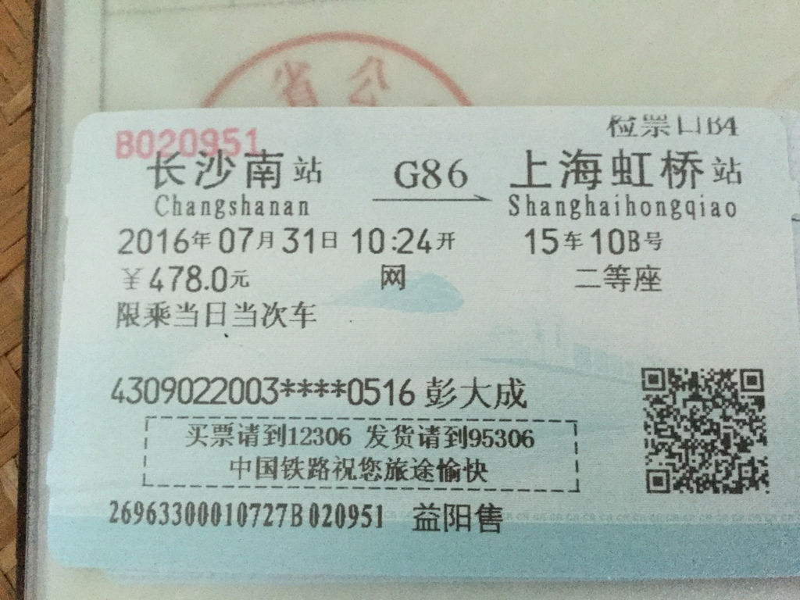

# 火车票上的身份证号
像这样的火车票,可以根据身份证号码缩小*号表示的范围  
  
图片[这里](https://zhidao.baidu.com/question/363828832943808652.html)找的,以下是代码
```python
#!/usr/bin/python
# -*- coding:utf-8 -*-
# python main.py 4309022003****0516
import datetime, sys

front = sys.argv[1][:6]
year = sys.argv[1][6:10]
back = sys.argv[1][14:]
# 0－1－2－3－4－5－6－7－8－9－10
# 1－0－X－9－8－7－6－5－4－3－2
if back[-1] == 'x' or back[-1] == 'X':
    b = '10'
else:
    b = back[-1]
b = 12 - int(b)
if b == 11: b = 0
if b == 12: b = 1

start = datetime.datetime.strptime(f'{year}0101', '%Y%m%d')
end = datetime.datetime.strptime(f'{year}1231', '%Y%m%d')

while start <= end:
    n = f"{front}{start.strftime('%Y%m%d')}{back}"
    # 乘以系数 7 9 10 5 8 4 2 1 6 3 7 9 10 5 8 4 2 后求和,再求除以11的余数
    if (int(n[0]) * 7 + int(n[1]) * 9 + int(n[2]) * 10 + int(n[3]) * 5 +
            int(n[4]) * 8 + int(n[5]) * 4 + int(n[6]) * 2 + int(n[7]) * 1 +
            int(n[8]) * 6 + int(n[9]) * 3 + int(n[10]) * 7 + int(n[11]) * 9 +
            int(n[12]) * 10 + int(n[13]) * 5 + int(n[14]) * 8 +
            int(n[15]) * 4 + int(n[16]) * 2) % 11 == b:
        print(n)
    start += datetime.timedelta(days=1)
```