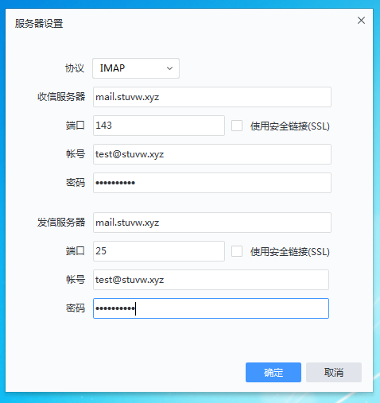

# 自建邮箱服务
### MX记录
邮箱不同于网站,除了A记录和CNAME,还需要MX记录.需要准备一台有公网ip的服务器和一个域名,ip为`a.b.c.d`,域名为`stuvw.xyz`,操作系统为CentOS 7.我的放在了腾讯云上,用的也是腾讯云的DNS服务,设置如下:
| 主机记录 | 记录类型 | 记录值 | MX优先级 |
| :-: | :-: | :-: | :-: |
| @ | MX | a.b.c.d. | 5 |
| @ | TXT | v=spf1 a mx ip4:a.b.c.d -all | - |
| mail | A | a.b.c.d | - |
等待DNS生效后,验证
```bash
dig mx stuvw.xyz +short
dig stuvw.xyz +short
dig mail.stuvw.xyz +short
dig txt stuvw.xyz +short
```
### 发邮件的postfix
1. 有一台基于CentOS 7的服务器,并且已经更新到最新
2. 在该主机上确认可以访问外部smtp服务器
    ```bash
    echo | telnet smtp.163.com 25
    echo | telnet smtp.qq.com 25
    ```
    通则成功,目前来看,腾讯云并没有封25端口
3. 更改主机名
    ```bash
    echo mail.stuvw.xyz > /etc/hostname
    ```
4. 安装postfix
    ```bash
    yum install postfix -y
    ```
    我的这台服务器上安装完操作系统后自带postfix,但是启动失败,查看日志`/var/log/maillog`报如下错误
    ```
    mail postfix[1117]: fatal: parameter inet_interfaces: no local interface found for ::1
    ```
    在`/etc/hosts`中暂时注释掉ipv6相关选项即可.启动它
    ```bash
    systemctl enable postfix.service
    systemctl restart postfix.service
    ```
5. 发一封邮件测试
    ```bash
    echo "body" | mail -s "subject" beifangwudi@outlook.com
    ```
    顺利收到,但是发件人显示为`root@mail.stuvw.xyz`
6. 配置文件`/etc/postfix/main.cf`  
我想把发件人改成`root@stuvw.xyz`
    ```
    # 主机名,域名mydomain默认是myhostname去掉第一部分
    myhostname = mail.stuvw.xyz
    mydomain = stuvw.xyz
    # myorigin就是邮箱@后面那一串
    myorigin = $mydomain
    # postfix监听所有网卡
    # 将inet_interfaces = localhost注释
    inet_interfaces = all
    # 来自以下目的的邮件就接收
    mydestination = $myhostname, localhost.$mydomain, localhost, $mydomain
    # 信任该网络,postfix默认只允许该网段收发信
    mynetworks = 127.0.0.0/8
    ```
    重启postfix再发送,成功
### 收邮件的dovecot
此时已经可以发送邮件,但是查看邮件还要登录服务器,所以需要安装dovecot远程收取邮件
1. 安装
    ```bash
    yum install dovecot -y
    ```
2. 再配置postfix
    1. 用sasl进行验证
        ```
        # 在/etc/postfix/main.cf最后追加
        smtpd_sasl_type = dovecot
        smtpd_sasl_path = private/auth
        smtpd_sasl_auth_enable = yes
        broken_sasl_auth_clients = yes
        smtpd_sasl_authenticated_header = yes
        smtpd_sasl_security_options = noanonymous
        # 过滤信件,允许接收发信地址为信任网络和经过sasl验证的邮件
        smtpd_recipient_restrictions = permit_mynetworks, permit_sasl_authenticated, reject_unauth_destination
        ```
    2. 启用tls加密
        ```
        # 再追加
        smtpd_use_tls = yes
        smtpd_tls_cert_file = /etc/pki/dovecot/certs/dovecot.pem
        smtpd_tls_key_file = /etc/pki/dovecot/private/dovecot.pem
        ```
    3. 将邮件存放到用户目录
        ```
        # 修改/etc/postfix/main.cf
        home_mailbox = Maildir/
        ```
    4. 启用465和587端口
        ```
        # 取消/etc/postfix/master.cf中的注释
        submission inet n       -       n       -       -       smtpd
            -o syslog_name=postfix/submission
            -o smtpd_tls_security_level=encrypt
            -o smtpd_sasl_auth_enable=yes
        smtps     inet  n       -       n       -       -       smtpd
            -o syslog_name=postfix/smtps
            -o smtpd_tls_wrappermode=yes
            -o smtpd_sasl_auth_enable=yes
        ```
    5. 重启服务
        ```bash
        systemctl restart postfix.service
        ```
3. 配置dovecot
    1. 让dovecot知道去哪里查找邮件
        ```
        # /etc/dovecot/conf.d/10-mail.conf
        mail_location = Maildir:~/Maildir
        ```
    2. 启用明文密码
        ```
        # /etc/dovecot/conf.d/10-auth.conf
        disable_plaintext_auth = no
        auth_username_format = %n
        ```
    3. 启用imap和pop3
        ```
        # /etc/dovecot/dovecot.conf
        protocols = imap pop3 lmtp
        listen = *
        ```
    4. dovecot和postfix在同一台机器时用socket通信
        ```
        # /etc/dovecot/conf.d/10-master.conf取消下面的注释
        unix_listener /var/spool/postfix/private/auth {
            mode = 0666  
        }
        ```
    5. 配置文件夹
        ```
        # /etc/dovecot/conf.d/15-mailboxes.conf
        # 需要哪些文件夹就启用哪些,比如
        mailbox Drafts {
            auto = subscribe
            special_use = \Trash
        }
        # 对于有些收信客户端来说,没有Trash是无法删除邮件的
        ```
    6. 启动服务
        ```bash
        systemctl enable dovecot.service
        systemctl start dovecot.service
        ```
4. 测试一下 
    1. 新建普通用户
        ```
        useradd test
        passwd test
        ```
    2. 登录客户端,配置如下  
    
    3. 尝试收发邮件,成功