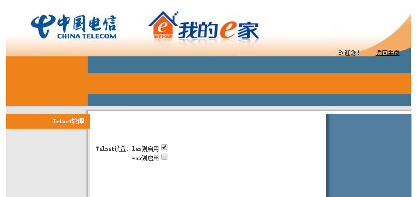

# 友华PT920获得telecomadmin
### 有一个后门
这个光猫默认没有开telnet,不过还是留了一个后门.直接用POST访问这个地址`http://192.168.1.1/cgi-bin/telnet.asp`会出现打开telnet的页面.
```bash
curl -sL 'http://192.168.1.1/cgi-bin/telnet.asp' -d 'http://192.168.1.1/cgi-bin/telnet.asp'
```
### 用Chrome打开telnet
上面那个方法是命令行的,正常人还得借助现代浏览器.为了不跨域,首先打开光猫的任意页面,然后按F12进入控制台,复制以下代码进去.
```javascript
var script = document.createElement("script");
script.type = "text/javascript";
script.src = "http://libs.baidu.com/jquery/1.9.0/jquery.js";
document.getElementsByTagName('head')[0].appendChild(script);
```
引入jQuery后,发送post请求.上下两段代码要分两次复制粘贴.
```javascript
$.ajax({
    type: "POST",
    url: "http://192.168.1.1/cgi-bin/telnet.asp",
    data: "http://192.168.1.1/cgi-bin/telnet.asp",
    success: function(res) {
        var obj = window.open("about:blank");
        obj.document.write(res);
    }
});
```
点击lan侧启用telnet,确定即可.  

### 登录光猫
```bash
telnet 192.168.1.1
```
账号admin,密码1234.进入光猫后找到/tmp/ctromfile.cfg,查找`telecomadmin`字符串,会得到你想要的.