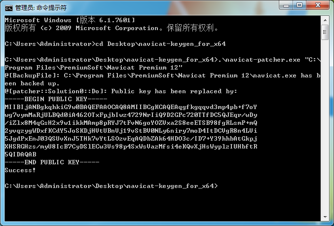
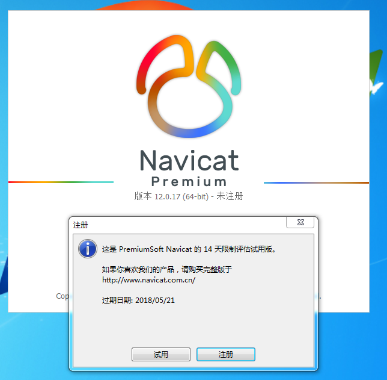
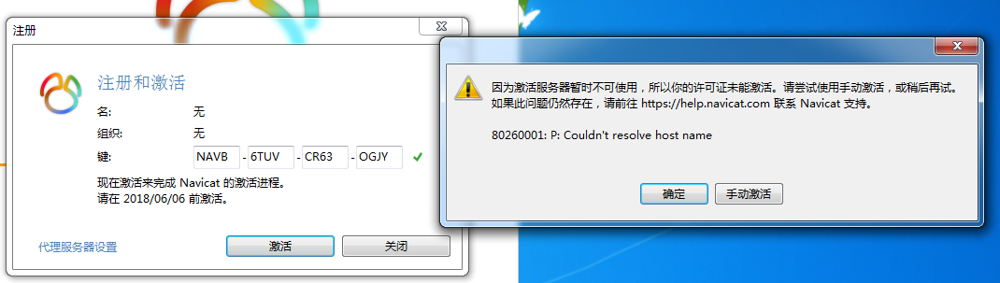
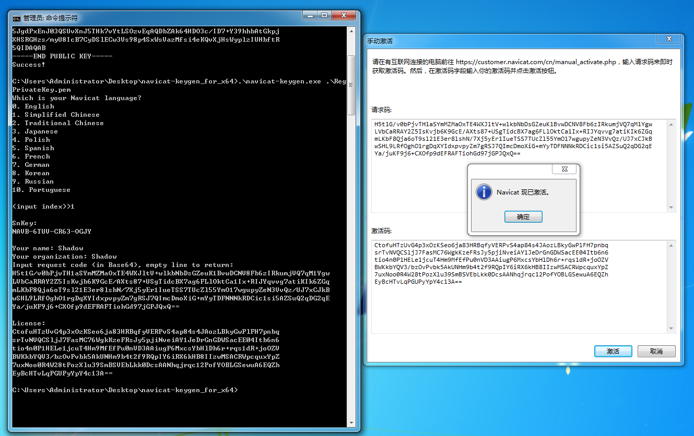

# Navicat的激活
1. 下载[Navicat Premium 版本 12](http://www.navicat.com.cn/download/navicat-premium)的64位Windows版
2. 安装
3. 下载[navicat-keygen](https://github.com/DoubleLabyrinth/navicat-keygen/releases)最新版,步骤可以查看Usage.txt或者[项目主页](https://github.com/DoubleLabyrinth/navicat-keygen)的`How to use`,也可以继续往下看
4. 执行`navicat-patcher.exe`
    ```powershell
    .\navicat-patcher.exe "C:\Program Files\PremiumSoft\Navicat Premium 12"
    ```
      
    版本号大于等于12.0.25的 Navicat Premium 输出会有些不同
5. 执行`navicat-keygen.exe`
    ```powershell
    .\navicat-keygen.exe .\RegPrivateKey.pem
    ```
    语言依下载的版本而定,这里选择简体中文,名字和组织随便填.出现`Input request code`时,打开Navicat,注意不要关闭命令行窗口.
6. 注册  

7. 断网之后再操作  
  
填入5中的序列号,手动激活
8. 复制粘贴  
将激活窗口的请求码复制到命令行窗口,敲两下回车,再将生成的激活码复制到激活码窗口,最后激活  

9. 激活的原理是替换掉官方的公钥,[项目主页](https://github.com/DoubleLabyrinth/navicat-keygen)里写得很详细,mac分支中有macOS版本的的.