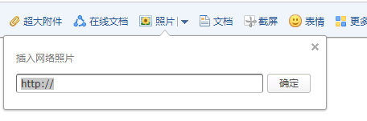

# 邮件追踪术
所谓邮件追踪,就是在要发送的邮件里放上自己服务器的一张图片,这样接收者打开邮件时就会知道他是在何时何地什么邮件客户端打开的.
1. 先生成一张图片
```python
from PIL import Image
Image.new('RGBA', (1, 1), (0, 0, 0, 0)).save("test.png")
```
2. 公网上架设web服务器提供图片
```python
#!/usr/bin/python3
# -*- coding:utf-8 -*-

import os, logging
os.chdir(os.path.split(os.path.realpath(__file__))[0])
logging.basicConfig(
    level=logging.WARNING,
    format='%(asctime)s[runtime:%(relativeCreated)d]~'
    '%(filename)s[line:%(lineno)d]~%(levelname)s~%(message)s',
    filename='r.log')
logging.getLogger().addHandler(logging.StreamHandler())
from flask import Flask, request, send_file
app = Flask(__name__)


@app.before_request
def before_request():
    # 记录当前请求
    logging.warning({
        'headers':
        dict(request.headers),
        'url':
        request.url,
        'ip':
        '%s:%d' % (request.remote_addr, request.environ.get('REMOTE_PORT'))
    })


@app.route('/i')
def get_image():
    return send_file('test.png', mimetype='image/png')


app.run(host='0.0.0.0', port=80, debug=False)
```
3. 以QQ邮箱为例,邮件中插入图片  

4. 对方接受以后,会有如下日志
```
2018-05-30 19:34:04,729[runtime:191352]~test.py[line:25]~WARNING~{'ip': '114.221.91.233:35080', 'headers': {'Accept-Language': 'zh-CN,zh;q=0.9', 'Accept': 'image/webp,image/apng,image/*,*/*;q=0.8', 'Host': '195.112.172.152', 'Dnt': '1', 'Connection': 'keep-alive', 'User-Agent': 'Mozilla/5.0 (Windows NT 10.0; Win64; x64) AppleWebKit/537.36 (KHTML, like Gecko) Chrome/66.0.3359.181 Safari/537.36', 'Accept-Encoding': 'gzip, deflate', 'Referer': 'https://mail.qq.com/'}, 'url': 'http://195.112.172.152/i'}
```
事就这样成了