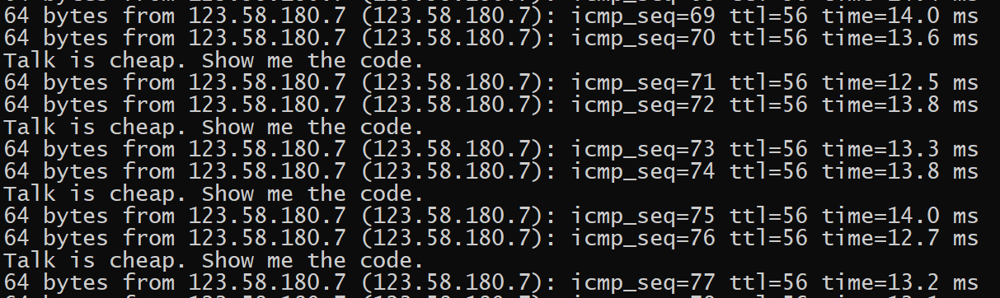

# 注入Linux进程
系统中有这样一个进程`ping 163.com`,在不影响其运行的情况下,借助它执行自己的代码.测试环境以`Ubuntu 18.04`为例,安装有gcc和gdb  

```c
#include <pthread.h>
#include <stdio.h>
#include <unistd.h>

void* run(void* n)
{
    while (1) {
        printf("Talk is cheap. Show me the code.\n");
        sleep(2);
    }
    return NULL;
}

__attribute__((constructor)) void start_thread()
{
    pthread_t tid;
    pthread_attr_t attr;

    if (pthread_attr_init(&attr) == -1 || pthread_attr_setdetachstate(&attr, PTHREAD_CREATE_DETACHED) == -1)
        return;

    pthread_create(&tid, &attr, run, NULL);
}
```
编译
```bash
gcc -Wall -O2 -fPIC -shared -lpthread -o doraemon.so ./doraemon.c
```
用gdb注入
```bash
echo 'print __libc_dlopen_mode("/root/doraemon.so", 2)' | gdb -p 1144
```
结果如下  
  
常规情况下,用`ps`和`top`无法发现注入,但是可以用`ps -Tp 1144`和`top -Hp 1144`来查看对应进程的线程.