# bash杂记
### 重定向
bash在执行一个命令的时候,会给这个命令预备3个文件描述符:输入,输出和错误.所有的重定向都是为了将这3个文件描述符和实际文件绑定起来,可以一对一的绑定,也可以多对一的绑定,但同一个文件描述符不能绑定多个文件.
1. &>,>&
    ```
    # 这3条命令的意思是一样的
    echo 1 &> 1.log
    echo 1 >& 1.log
    echo 1 > 1.log 2>&1
    ```
2. <&,>&  
文件描述符的复制.重定向符号的两边都是代表描述符的数字,都是把右边的描述符绑定的文件绑定到左边,使得左右两边的描述符都绑定到同一个文件.实测在64位Ubuntu 16.04(bash 4.3.48)上,这两个符号的作用是一样的.  
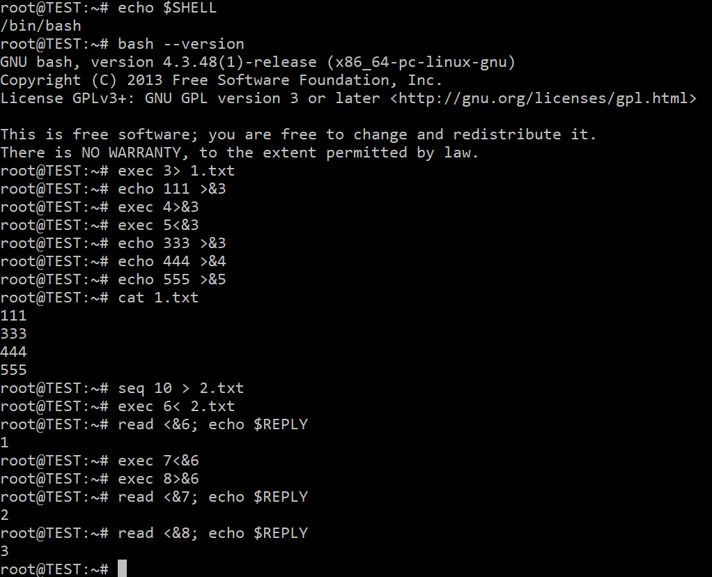
3. <&-,>&-  
文件描述符既然有复制和建立,必然就有转移和关闭.`4<&3-`和`4>&3-`的意思完全一样,都是把和描述符3绑定的文件绑定到描述符4上,然后把3关闭.`5<&-`也和`5>&-`一样,都是关闭描述符5.
4. <(cmd),>(cmd)  
进程替换.将一个cmd的输入或者输出本身当做文件使用.
    ```
    # 3条命令作用相同
    grep [0-9] <(find /etc)
    grep [0-9] < <(find /etc)
    find /etc | grep [0-9]
    ```
    同时在多台机器上执行`uname -a`  
    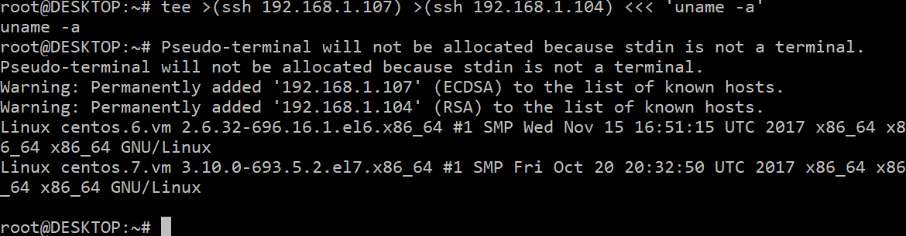
### 子进程
1. 终端中正运行着一个命令,如何在终端关闭之后继续运行它  
先Ctrl+Z暂停进程,再用bg将进程切换到后台,最后disown使进程忽略HUP信号  
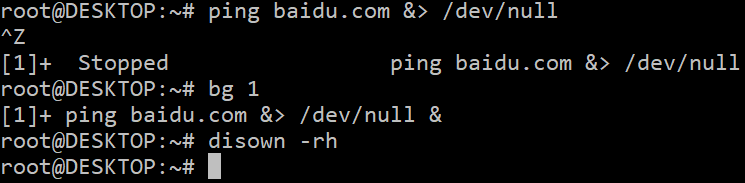  
其中,Ctrl+z等同于`kill -19 $pid`,bg等同于`kill -18 $pid`
2. 后台运行着一个命令,如何将它放到前台继续运行  
1的缺陷就是Ctrl+z需要手动,虽然不太可能会遇到批量操作,但还是需要一个方案以备不测.
    * 终端A  
    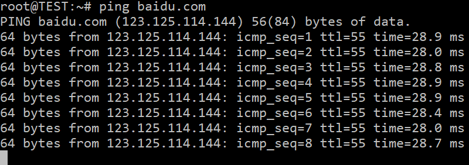
    * 终端B  
    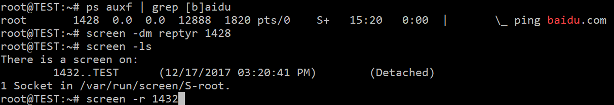  
    此时会发现,ping已经在终端B的screen里面运行了  
    reptyr不仅能让终端A中的命令在终端B中运行,还能把后台命令转移到前台  
    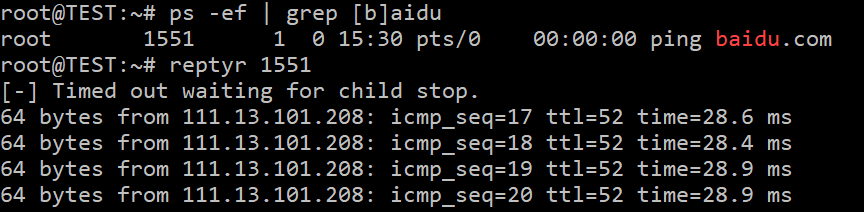
3. 如何让一个命令从一开始就脱离终端运行  
   1. nohup  
   原理是使进程忽略HUP信号从而苟活,相当于这样
        ```
        # nohup.sh
        trap '' HUP
        exec "$@"
        ```
   2. setsid  
   另起一个会话运行命令,也就是说,和当前终端再没有关系,是一种比较彻底的方式.  
   3. ()和&  
   ()是运行子shell,&是将命令放到后台.  
   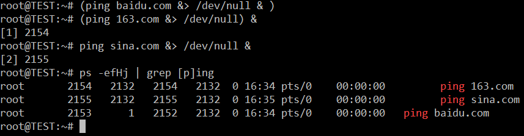  
   如果Ctrl+d退出终端后再进入  
   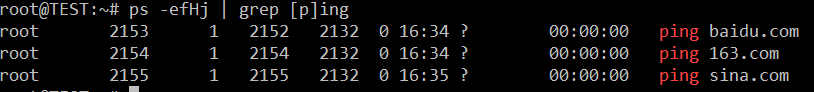  
   可以看到,3个进程最终都存活了下来,但如果是直接右上角关闭终端再打开  
   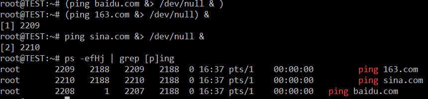  
   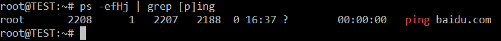  
   只有1个活着.因为我是用ssh登录,猜测和终端关闭的方式有关.
   4. coproc  
   bash管这个叫协程,用起来和function差不多.大概就是在子进程中运行命令,然后将该命令的输入输出绑定到父进程的文件描述符中,使父子进程得以交流.  
   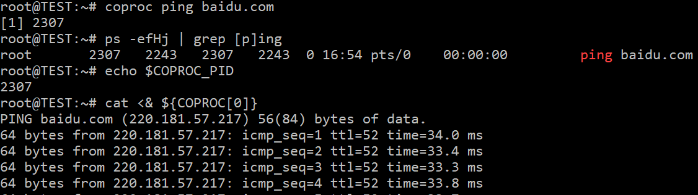  
   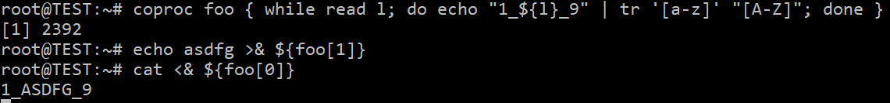
### 并行
bash自身的作业控制对并行几乎没什么实现,所以出现了很多奇怪的用法,比如用命名管道,模拟队列还有前面提到的进程替换,看上去很geek,实则不太方便.从实用角度考虑,如果打算在bash的命令行中实现并行化,不一定得用bash自带的语法,只要能完成任务,那就是好猫.  
1. xargs  
    ```
    # 3进程同时下载10个文件
    seq 10 | xargs -P3 -i wget http://abc.cn/{}.txt
    # 判断该网段主机是否存活
    seq 254 | xargs -P0 -i ping 192.168.1.{}
    # 并行输出10个数(结果是乱序)
    seq 0 9 | xargs -P0 -i bash -c 'sleep 3; echo -n $1' -- {}
    ```
    xargs用来并行的选项是P,后面的3就是最大并行数为3,为0就是尽可能的多并行.
2. parallel  
顾名思义,这是最强大的一个并行命令,然而实际用得不多.这里是[文档](https://www.gnu.org/software/parallel/man.html).
3. python/perl  
xargs可以完成绝大部分需求,然而太粗犷,控制粒度不够精细是bash一贯以来的风格,所以需要通用编程语言来弥补缺陷.之前Perl和Awk很流行,现在正在往Python和Lua的方向演变.CentOS 7的最小化安装已经没有perl了,所以就跨平台而言,python才是最好的选择.