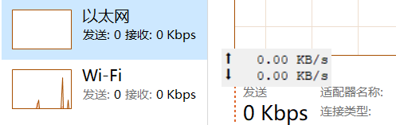

# 网速悬浮窗
做了一个显示网速的悬浮窗,只有最基本的功能,略丑,和任务管理器比起来像这样:  
  
勉强能用,代码如下
```python
#!/usr/bin/python3
# -*- coding:utf-8 -*-

import psutil, tkinter
# 初始化窗口
root = tkinter.Tk()
root.geometry("-50+50")
root.overrideredirect(True)
root.resizable(False, False)
root.attributes('-topmost', 1)
label = tkinter.Label(root)
label.pack()


# 可拖动
def move(e):
    root.geometry(f'+{e.x_root}+{e.y_root}')


label.bind('<B1-Motion>', move)

old_data = psutil.net_io_counters()
net_unit = ['K', 'M', 'G', 'T', 'P', 'E', 'Z', 'Y']


def refresh():
    global old_data
    new_data = psutil.net_io_counters()
    bytes_sent = (new_data.bytes_sent - old_data.bytes_sent) / 1024
    bytes_recv = (new_data.bytes_recv - old_data.bytes_recv) / 1024
    old_data = new_data

    for s in net_unit:
        if bytes_sent >= 1000:
            bytes_sent /= 1024
        else:
            break
    for r in net_unit:
        if bytes_recv >= 1000:
            bytes_recv /= 1024
        else:
            break

    label.config(
        text=f'⬆ {bytes_sent:>6.2f} {s}B/s\n⬇ {bytes_recv:>6.2f} {r}B/s',
        width=13,
        font=('Courier', 10))
    root.after(1000, refresh)


root.after(0, refresh)
root.mainloop()
```