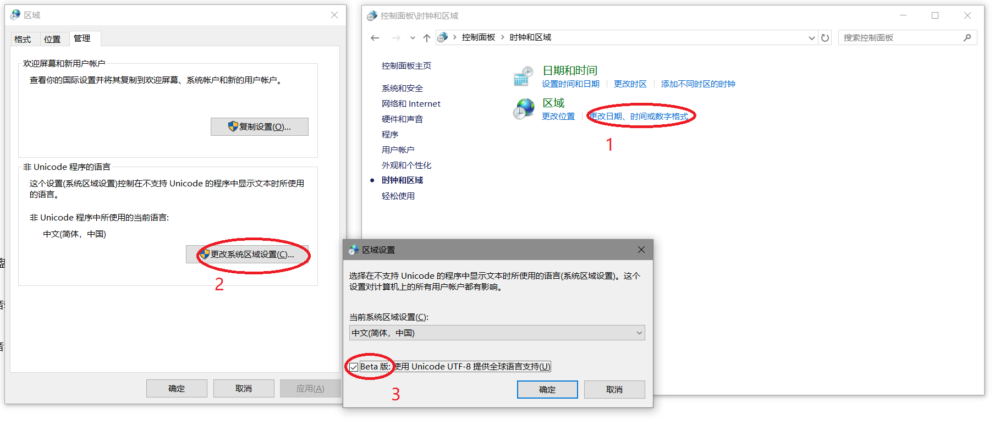

# PowerShell使用UTF-8
1. 对于单一命令
```powershell
# 以utf-8读取
Get-Content .\1.txt -Encoding utf8
# 以utf-8写入文件
some-command ... | Out-File -Encoding UTF8 .\2.txt
```
2. 对于全局,一般用于配置文件
```powershell
# 输出到文件
$PSDefaultParameterValues['Out-File:Encoding'] = 'utf8'
# 输出到控制台
[Console]::OutputEncoding = [Text.UTF8Encoding]::UTF8
```
3. 对于CMD和PowerShell
```powershell
& "$env:windir\system32\chcp.com" 65001
```
4. 对于新版Windows(1803)  
