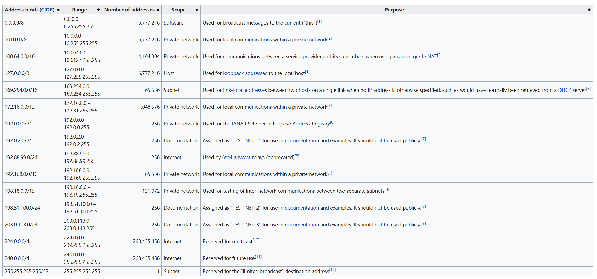

# 保留的IPv4地址
现有内网要增设网段,在192.168.0.0/16,172.16.0.0/12,10.0.0.0/8已经被使用的情况下,可以启用240.0.0.0/4网段,包含240.0.0.0/8~255.0.0.0/8在内的16个A类地址,足够使用.  
  
参考[Reserved IP addresses](https://en.wikipedia.org/wiki/Reserved_IP_addresses)